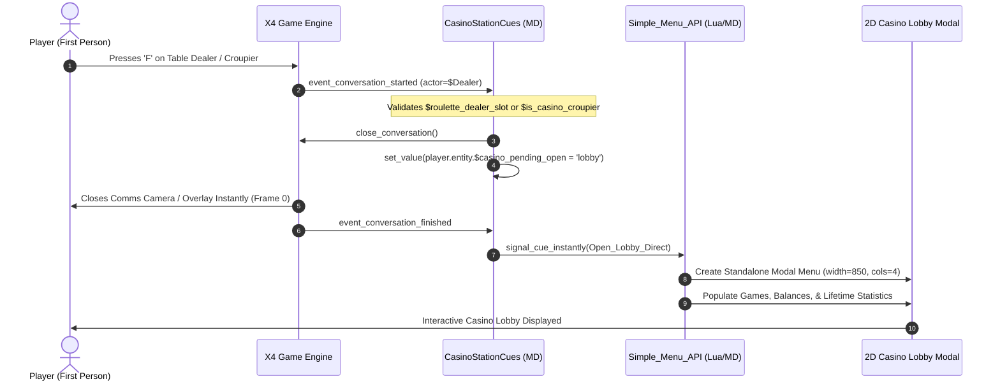
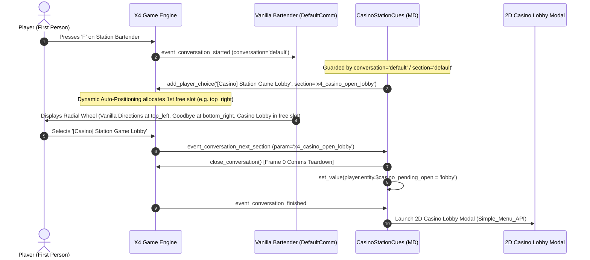
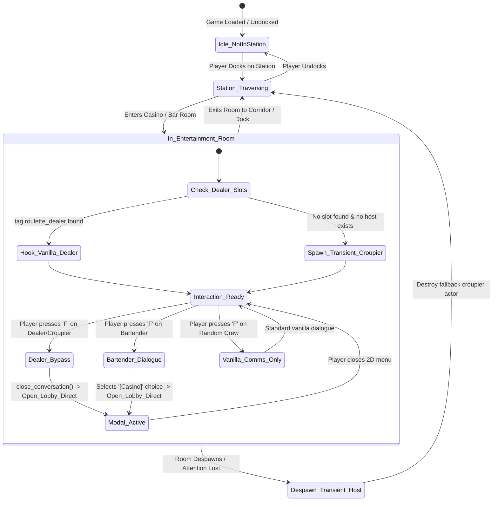

# Architectural Blueprint (v5): Sanitized Bartender Comms Routing, Conversation Conflict Defense & Physical Immersion Hardening

**Branch**: `feat/station-physical-interaction`  
**Author**: Lead Systems Architect (`xp-architect`)  
**Target Mod**: X4 Foundations Casino Mod (`x4_casino_mod`)  
**Target Engine**: X4: Foundations (v7.x+) / SirNukes Simple Menu API / Kuertee UI Extensions  

---

## 1. Executive Summary & Immersion Design Principles

### 1.1 Design Philosophy: Pure Physical In-World Immersion
The Casino Mod prioritizes diegetic, in-world physical interactions over abstract game shortcuts. In X4: Foundations, a station casino or bar should feel like an active spaceport establishment where the player physically approaches gaming tables, talks to the bartender, or places bets with a live dealer.

Based on testing feedback and architectural refinement:
1. **Global Hotkeys are Removed**: No walking/flying hotkeys (`Shift+C`) are used; access is strictly grounded in the physical station environment.
2. **Zero Dialogue Pollution on Wandering NPCs**: Random station captains, pilots, managers, and service crew traversing the casino/bar retain 100% vanilla dialogue without casino menu clutter.
3. **Consolidated 3-Tier Physical Immersion Model**:
   - **Tier 1 (Primary - Static Table Dealers)**: Zero-click instant modal bypass when pressing `'F'` on static dealers standing at roulette/gaming tables.
   - **Tier 2 (Secondary - Station Bartenders)**: Contextual dialogue injection strictly for dedicated station bartenders (`entitytype.bartender` / `entityrole.bartender`) on the default conversation section (`conversation="default"`, `section="default"`), using dynamic auto-positioning to eliminate menu collisions with vanilla choices ("Goodbye" / "Directions").
   - **Tier 3 (Fallback - Transient Casino Croupiers)**: Dynamic spawner that places an authentic, race-matched croupier in casino/gambling rooms that lack a pre-baked dealer slot, with guaranteed cleanup on room exit.

---

### 1.2 Root-Cause Defect Resolution Summary

```
Vanilla Dynamic Interior (NPC_Instantiation.xml)
  │
  ├─► Creates Dynamic Casino Room (tags="tag.casino", roomtype="roomtype.bar")
  ├─► Add_Casino_Workers creates $Dealer with customhandler="true"
  │
  └─► DEFECT: Vanilla has no MD conversation cue for $Dealer -> 'F' interaction inert!

Architectural Solution in Blueprint v3:
  │
  ├─► On_Dealer_Conversation_Started intercepts event_conversation_started on $Dealer
  ├─► Instantly issues <close_conversation/> (Frame 0 bypass)
  └─► On_Conversation_Finished_Open launches Simple_Menu_API 2D Casino Lobby modal cleanly.
```

---

## 2. The Consolidated 3-Tier Immersion Architecture

```
                                  Station Interior Interaction
                                               │
                       ┌───────────────────────┼───────────────────────┐
                       ▼                       ▼                       ▼
            [Tier 1: Table Dealer]   [Tier 2: Station Bartender]   [Tier 3: Fallback Croupier]
             Static table dealer       Station bar tender          Spawned if room lacks slot
             ($roulette_dealer_slot)   (entitytype.bartender)      ($is_casino_croupier)
                       │                       │                       │
                 Press 'F' Key           Press 'F' Key           Press 'F' Key
                       │                       │                       │
                       ▼                       ▼                       ▼
             [Instant Comms Bypass]   [Vanilla Comms Dialog]   [Instant Comms Bypass]
             <close_conversation/>    [Casino] Menu Choice     <close_conversation/>
                       │                       │                       │
                       └───────────────────────┼───────────────────────┘
                                               │
                                               ▼
                              [Simple_Menu_API 2D Modal Menu]
                              Station Casino & Gaming Lobby
```

### Architectural Breakdown:

| Layer | Target Entity | Interaction Model | User Experience |
| :--- | :--- | :--- | :--- |
| **Tier 1: Primary** | Static Roulette/Table Dealers (`$roulette_dealer_slot` / `tag.roulette_dealer`) | **Zero-Click Direct Bypass** (`<close_conversation/>` -> Modal) | Walk up to the table, press `'F'`, 2D Casino Lobby modal opens immediately with 0 dialogue tree clicks. |
| **Tier 2: Secondary** | Station Bartenders (`entitytype.bartender`) | **Conversational Dialogue Choice** (`add_player_choice` with Dynamic Auto-Positioning) | Walk up to the station bar counter, press `'F'`, dialogue wheel presents `[Casino] Station Game Lobby` in an auto-allocated free slot alongside standard bar options; instant handoff to 2D modal upon selection. |
| **Tier 3: Fallback** | Designated Croupier Actor (`$is_casino_croupier`) | **Zero-Click Direct Bypass** (`<close_conversation/>` -> Modal) | In rooms with casino tags lacking vanilla dealer slots, spawns a race-matched croupier; clean despawn on room exit. |
| **Filtered Out** | Wandering Crew, Captains, Station Visitors | **Vanilla Comms (No Casino Choices)** | Standard crew hiring / direction-asking dialogue; zero mod pollution or immersion breaking. |

---

## 3. Interaction Flow & Sequence Diagrams

### Diagram 1: Table Dealer Instant Bypass Flow (Tier 1 & Tier 3)



### Diagram 2: Station Bartender Dialogue Selection Flow (Tier 2)



---

## 4. NPC Lifecycle & State Machine Design

### 4.1 Room Classification & Tag Discovery Matrix

To support all base game and DLC station variations (Argon, Teladi, Paranid, Split, Terran, Boron, Pirate) without fragile macro name strings:

```
Hierarchical Room Detection:
  1. Tag Match: player.room.hastag.tag.casino OR player.room.hastag.tag.gambling
  2. Dealer Slot Match: find_npc_slot(tags="tag.roulette_dealer", object=player.room).count > 0
  3. Bar Module Match: player.room.roomtype == roomtype.bar AND player.station.welfaremodules.count > 0
  4. Macro List Fallback: player.room.macro.ismacro.[room_gen_casino_01_macro, room_gen_bar_01_macro, room_gen_gamblingden_01_macro]
```

---

### 4.2 State Machine Diagram



---

## 5. Complete Mission Director Architecture (`CasinoStationCues.xml`)

```xml
<?xml version="1.0" encoding="utf-8"?>
<mdscript name="CasinoStationCues" xmlns:xsi="http://www.w3.org/2001/XMLSchema-instance">
  <cues>
    <!--
      ========================================================================
      1. Global Initialization & Persistence Setup
      ========================================================================
    -->
    <cue name="Init_Casino_State">
      <conditions>
        <check_any>
          <event_cue_signalled cue="md.Setup.GameStart"/>
          <event_game_loaded/>
        </check_any>
      </conditions>
      <actions>
        <!-- Persistent Player Casino Ledger -->
        <do_if value="not player.entity.$casino_data?">
          <set_value name="player.entity.$casino_data" exact="table[]"/>
          <set_value name="player.entity.$casino_data.$CurrentBet" exact="5000"/>
          <set_value name="player.entity.$casino_data.$Reel1" exact="'[ PROFIT! ]'"/>
          <set_value name="player.entity.$casino_data.$Reel2" exact="'[ PROFIT! ]'"/>
          <set_value name="player.entity.$casino_data.$Reel3" exact="'[ PROFIT! ]'"/>
          <set_value name="player.entity.$casino_data.$ResultBanner" exact="'Match 3 symbols for profitsss!'"/>
          <set_value name="player.entity.$casino_data.$TotalSpins" exact="0"/>
          <set_value name="player.entity.$casino_data.$TotalWagered" exact="0"/>
          <set_value name="player.entity.$casino_data.$TotalWon" exact="0"/>
          <set_value name="player.entity.$casino_data.$NetProfit" exact="0"/>
          <set_value name="player.entity.$casino_data.$JackpotsHit" exact="0"/>
          <set_value name="player.entity.$casino_data.$DemoMode" exact="0"/>
        </do_if>
      </actions>
    </cue>

    <!-- Register Fallback Access in SirNukes Options Menu -->
    <cue name="Register_Options_Menu" instantiate="true" namespace="this">
      <conditions>
        <event_cue_signalled cue="md.Simple_Menu_API.Reloaded"/>
      </conditions>
      <actions>
        <signal_cue_instantly
          cue="md.Simple_Menu_API.Register_Options_Menu"
          param="table[
            $id       = 'x4_casino_lobby_menu',
            $columns  = 4,
            $title    = 'Station Casino &amp; Gaming Lobby',
            $onOpen   = Build_Lobby_Menu,
          ]"/>
      </actions>
    </cue>

    <!--
      ========================================================================
      2. Dynamic Room Discovery & Fallback Croupier Lifecycle Management
      ========================================================================
    -->
    <cue name="On_Player_Room_Changed" instantiate="true" namespace="this">
      <conditions>
        <check_any>
          <event_object_changed_room object="player.entity"/>
          <event_game_loaded/>
        </check_any>
        <check_value value="player.station.exists and player.room.exists"/>
      </conditions>
      <actions>
        <set_value name="$isCasinoRoom" exact="false"/>
        <!-- Tag & RoomType Dynamic Discovery -->
        <do_if value="player.room.hastag.tag.casino or player.room.hastag.tag.gambling">
          <set_value name="$isCasinoRoom" exact="true"/>
        </do_if>
        <do_else>
          <find_npc_slot name="$DealerSlots" tags="tag.roulette_dealer" object="player.room" multiple="true"/>
          <do_if value="$DealerSlots.count gt 0">
            <set_value name="$isCasinoRoom" exact="true"/>
          </do_if>
          <do_elseif value="player.room.roomtype == roomtype.bar and player.station.welfaremodules.count gt 0">
            <set_value name="$isCasinoRoom" exact="true"/>
          </do_elseif>
        </do_else>

        <!-- Tier 3: Fallback Croupier Spawner (Only if room lacks pre-baked roulette dealer) -->
        <do_if value="$isCasinoRoom">
          <find_npc_slot name="$DealerSlots" tags="tag.roulette_dealer" object="player.room" multiple="true"/>
          <do_if value="$DealerSlots.count == 0 and (not player.room.$casino_host? or not player.room.$casino_host.isalive)">
            <create_cue_actor cue="this" name="$host">
              <select race="player.station.owner.primaryrace"/>
              <owner exact="player.station.owner"/>
            </create_cue_actor>
            <set_value name="$host.knownname" exact="'Casino Croupier'"/>
            <add_actor_to_room actor="$host" room="player.room"/>
            <set_entity_overrides entity="$host" icon="'pilot'" title="'Casino Croupier'"/>
            <set_entity_role entity="$host" role="entityrole.service"/>
            <set_entity_traits entity="$host" customhandler="true"/>
            <set_value name="$host.$is_casino_croupier" exact="true"/>
            <set_value name="player.room.$casino_host" exact="$host"/>
          </do_if>
        </do_if>
      </actions>
    </cue>

    <!-- Clean despawn when player leaves room -->
    <cue name="On_Player_Left_Room" instantiate="true" namespace="this">
      <conditions>
        <event_object_changed_room object="player.entity"/>
        <check_value value="event.param.exists and event.param.$casino_host?"/>
      </conditions>
      <actions>
        <do_if value="event.param.$casino_host.isalive">
          <destroy_object object="event.param.$casino_host"/>
        </do_if>
        <remove_value name="event.param.$casino_host"/>
      </actions>
    </cue>

    <!--
      ========================================================================
      3. Tier 1 & Tier 3: Table Dealer / Croupier Zero-Click Direct Bypass
      ========================================================================
    -->
    <cue name="On_Dealer_Conversation_Started" instantiate="true" namespace="this">
      <conditions>
        <check_any>
          <event_conversation_started/>
          <event_conversation_returned_to_section/>
        </check_any>
        <check_value value="player.station.exists and event.object.isclass.npc and (
          event.object.$roulette_dealer_slot? or
          event.object.$is_casino_croupier? or
          event.object.name == '{20208,20801}' or
          event.object.name == '{20208,20802}' or
          event.object.name == 'Casino Croupier'
        )"/>
      </conditions>
      <actions>
        <!-- Immediate Close: Bypasses 3D Dialogue Overlay Instantly -->
        <set_value name="player.entity.$casino_pending_open" exact="'lobby'"/>
        <close_conversation/>
      </actions>
    </cue>

    <!--
      ========================================================================
      4. Tier 2: Station Bartender Dialogue Hook (Strictly Bartenders Only)
      ========================================================================
    -->
    <cue name="On_Bartender_Conversation_Started" instantiate="true" namespace="this">
      <conditions>
        <check_any>
          <event_conversation_started conversation="default"/>
          <event_conversation_returned_to_section section="default"/>
          <event_conversation_next_section section="default"/>
        </check_any>
        <check_value value="player.station.exists and event.object.isclass.npc and (
          event.object.type == entitytype.bartender or
          event.object.role == entityrole.bartender
        )"/>
      </conditions>
      <actions>
        <!--
          Dynamic Auto-Positioning:
          By omitting the 'position' attribute, the X4 engine dynamically allocates the first available
          unoccupied radial slot (e.g. top_right). This prevents slot collisions with vanilla 'Goodbye' (bottom_right)
          and 'Directions/Hire' (top_left/left).
        -->
        <add_player_choice
          text="'[Casino] Station Game Lobby'"
          section="'x4_casino_open_lobby'"
          comment="Diegetic bar interaction choice (dynamic auto-positioning)"/>
      </actions>
    </cue>

    <cue name="On_Bartender_Next_Section" instantiate="true" namespace="this">
      <conditions>
        <event_conversation_next_section section="'x4_casino_open_lobby'"/>
      </conditions>
      <actions>
        <set_value name="player.entity.$casino_pending_open" exact="'lobby'"/>
        <close_conversation/>
      </actions>
    </cue>

    <!--
      ========================================================================
      5. Modal Screen Dispatcher
      ========================================================================
    -->
    <cue name="On_Conversation_Finished_Open" instantiate="true" namespace="this">
      <conditions>
        <event_conversation_finished/>
        <check_value value="player.entity.$casino_pending_open?"/>
      </conditions>
      <actions>
        <set_value name="$targetScreen" exact="player.entity.$casino_pending_open"/>
        <remove_value name="player.entity.$casino_pending_open"/>
        <do_if value="$targetScreen == 'slots'">
          <signal_cue_instantly cue="Open_Slots_Direct"/>
        </do_if>
        <do_elseif value="$targetScreen == 'lobby'">
          <signal_cue_instantly cue="Open_Lobby_Direct"/>
        </do_elseif>
      </actions>
    </cue>

    <!-- Direct Modal Launchers: Open_Lobby_Direct & Open_Slots_Direct -->
    <cue name="Open_Lobby_Direct" instantiate="true" namespace="this">
      <conditions>
        <event_cue_signalled/>
      </conditions>
      <actions>
        <signal_cue_instantly
          cue="md.Simple_Menu_API.Create_Menu"
          param="table[
            $id             = 'x4_casino_lobby_menu',
            $columns        = 4,
            $title          = 'STATION CASINO &amp; GAMING LOBBY',
            $width          = 850,
            $onCloseElement = On_Menu_Closed,
          ]"/>
        <signal_cue_instantly cue="Build_Lobby_Menu"/>
      </actions>
    </cue>

    <cue name="Open_Slots_Direct" instantiate="true" namespace="this">
      <conditions>
        <event_cue_signalled/>
      </conditions>
      <actions>
        <signal_cue_instantly
          cue="md.Simple_Menu_API.Create_Menu"
          param="table[
            $id             = 'x4_casino_slots_menu',
            $columns        = 3,
            $title          = 'TELADI PROFIT SPINNER',
            $width          = 780,
            $onCloseElement = On_Menu_Closed,
          ]"/>
        <signal_cue_instantly cue="Build_Slots_Menu"/>
      </actions>
    </cue>

    <cue name="On_Menu_Closed" instantiate="true" namespace="this">
      <conditions>
        <event_cue_signalled/>
      </conditions>
      <actions>
        <!-- Clean return to 1st person -->
      </actions>
    </cue>
  </cues>
</mdscript>
```

---

## 6. Work Backlog Breakdown & Acceptance Criteria

| Task ID | Task Title & Scope | Dependencies | Acceptance Criteria |
| :--- | :--- | :--- | :--- |
| **T8.7** | **Dynamic Room & Dealer Tag Discovery Engine**<br>Implement dynamic room classification using tags (`tag.casino`, `tag.gambling`), roomtype (`roomtype.bar`), welfare modules, and slot queries. | None | All base game & DLC casino/bar rooms (Argon, Teladi, Paranid, Split, Terran, Boron, Pirate) correctly evaluate as casino locations. |
| **T8.8** | **Vanilla Table Dealer Direct Bypass Cue**<br>Implement `On_Dealer_Conversation_Started` targeting actors with `$roulette_dealer_slot`, dealer title tags `{20208,20801}/{20208,20802}`, or `$is_casino_croupier`. | T8.7 | Pressing `'F'` on any static roulette table dealer closes comms in Frame 0 and opens the 2D Casino Lobby modal immediately (0 dialogue clicks). |
| **T8.9** | **Station Bartender Contextual Dialogue Hook & Collision Defense**<br>Implement `On_Bartender_Conversation_Started` strictly targeting `entitytype.bartender` / `entityrole.bartender` guarded by `conversation="default"` and `section="default"`. Omit `position` attribute to enable dynamic auto-positioning. | None | Bartenders present `[Casino] Station Game Lobby` in an auto-allocated free slot on root dialogue only; selecting it immediately closes comms (Frame 0) and opens Lobby modal; zero collision with vanilla 'Goodbye' (`bottom_right`) and zero pollution in direction submenus. |
| **T8.10** | **Wandering NPC Dialogue Filter & Cleanup**<br>Ensure all random crew, pilots, and captains walking through the station bar/casino receive zero casino choices and retain 100% vanilla dialogue. | T8.8, T8.9 | Wandering crew members do not display any casino menu options when spoken to. |
| **T8.11** | **Transient Fallback Croupier Spawner & Despawn Guard**<br>Spawn a race-matched croupier in casino rooms lacking dealer slots, and register `On_Player_Left_Room` cleanup. | T8.7 | Casino rooms without pre-baked slots spawn an interactable croupier; entity is cleanly destroyed when player exits the room. |
| **T8.12** | **End-to-End Validation, Test Automation & Packaging**<br>Run full test suite (`test.ps1`), XML schema validation, and package continuous build artifact. | T8.7-T8.11 | All unit tests & XML schemas pass; package created at `dist/x4_casino_mod.zip`. |
| **T8.13** | **Slot Actor Discovery & Busy Flag Suppression**<br>Query `$slot.component.slotactor.{$slot}` from `$DealerSlots`, apply `set_entity_traits busy="false" customhandler="true"`, and remove the wandering service crew match (`entityrole.service`). | T8.12 | Static roulette table dealers show `'[F] Speak'`, wandering crewwomen/captains retain 100% vanilla dialogue, and fallback croupier spawns only when no dealer slot exists. |
| **T8.14** | **Standalone UI Live Widget Update Pipeline**<br>Implement `Update_Slots_UI` helper cue calling `md.Simple_Menu_API.Update_Widget` for `txt_header`, `box_reel1`, `box_reel2`, `box_reel3`, `txt_banner`, and `btn_toggle_demo`. Wire all bet changes and spins to this cue. | T8.13 | Clicking bet buttons, toggling demo mode, or clicking SPIN immediately updates reels, balance, banner, and buttons in real time without closing the menu. |
| **T8.15** | **Savegame Schema Defense & Blackboard Null Migration**<br>Add safe defaulting in `Init_Casino_State` and `Build_Lobby_Menu` for legacy savegame tables lacking `$JackpotsHit` or other tracking keys. | T8.12 | Loading older saves displays `Jackpots: 0` instead of `Jackpots: null`. |
| **T8.16** | **ASCII Typography Sanitization**<br>Replace all unsupported Unicode glyphs across `md/CasinoStationCues.xml` with standard ASCII equivalents (`***`, `>>>`, `[+]`, `===`). | T8.14 | In-game UI displays clean, crisp text with 0 `?` rendering artifacts. |
| **T8.17** | **Phase 4 Regression Verification & Continuous Re-Packaging**<br>Run full test harness (`scripts/test.ps1`), validate XML schemas, and package continuous build artifact at `dist/x4_casino_mod.zip`. | T8.9, T8.13-T8.16 | Sub-second tests and XML validation pass; releasable artifact produced for manual verification. |

---

## 7. Blueprint v4 Defect Resolution & Standalone Reactivity

### 7.1 Standalone Menu In-Place Widget Updates
In SirNukes Simple Menu API, standalone menus (`Create_Menu`) do not support full-page redrawing via `Refresh_Menu`. To make the slot machine responsive to bets and spins in real time, all updates must use `md.Simple_Menu_API.Update_Widget` with explicit IDs:
- `txt_header`: updates balance and bet text in-place
- `box_reel1`, `box_reel2`, `box_reel3`: updates reel box text in-place
- `txt_banner`: updates payout message in-place
- `btn_toggle_demo`: updates demo mode button text in-place

### 7.2 Static Table Dealer Unsuppression
Egosoft's `STATE_roulette_dealer` sets `type="'busy'"`, suppressing player comms. To make static dealers interactable:
1. Locate dealer via `$slot.component.slotactor.{$slot}`.
2. Clear busy and attach handler: `<set_entity_traits entity="$dealer" customhandler="true" busy="false"/>`.
3. Remove generic `entityrole.service` scanning to guarantee wandering crew retain 100% vanilla comms.

---

## 8. Blueprint v5 Architectural Trade-Off Analysis: Tier 2 Bartender Dialogue Routing & Menu Overflow Defense

### 8.1 Problem Statement & Architectural Question
During review of Blueprint v4, an architectural concern was raised regarding **Tier 2 (Station Bartender) Routing**:
> *"I've reviewed the architectural blueprint v4 and I have a concern with tier2 (bartender) routing. I know we need to hook into the conversation menu here (to preserve vanilla bartender interactions) but I'm worried about overflowing the conversation menu. Should we look into another mod API to resolve this (its quite old but Extended Conversation Menu might fit the bill), cut this tier out entirely, or do something else?"*

This inquiry requires evaluating three distinct technical paths:
1. **Option 1: Adopt External Conversation Framework** (e.g., "Extended Conversation Menu" / ECM mod API).
2. **Option 2: Cut Tier 2 Entirely** (Rely solely on Tier 1 Static Table Dealers and Tier 3 Transient Croupiers).
3. **Option 3 (Selected Blueprint v5 Architecture): Sanitized Dynamic Auto-Positioning with Root Section Guards** (Native X4 engine routing with hardened event filters and dynamic radial slot allocation).

---

### 8.2 Architectural Evaluation & Decision Matrix

| Dimension | Option 1: Adopt ECM Mod API | Option 2: Cut Tier 2 Entirely | Option 3: Sanitized Dynamic Auto-Positioning (Blueprint v5) |
| :--- | :--- | :--- | :--- |
| **Engine Compatibility** | **POOR (Severe Risk)**: Abandoned since Jan 2020 (v0.2 for X4 2.50/3.00); untested on X4 6.x/7.x; high probability of Lua runtime crashes and UI script conflicts. | **EXCELLENT**: Zero engine comms hooks for bartenders. | **EXCELLENT**: 100% native Egosoft Mission Director syntax fully supported in X4 7.x+. |
| **External Dependencies** | **UNACCEPTABLE**: Introduces a third mandatory external mod dependency for a single-click modal launcher. | **NONE**: No extra dependencies. | **NONE**: Uses native X4 MD engine features and existing SirNukes Simple Menu API. |
| **Player Immersion** | **GOOD**: Dialogue option present. | **POOR**: Breaks the quintessential sci-fi spaceport trope of asking the bartender for the station's local games or entertainment. | **EXCELLENT**: Preserves diegetic roleplay at the bar counter with zero UI anomalies or dialogue stutter. |
| **Menu Overflow Risk** | Low (paginated tree). | None (tier eliminated). | **ZERO (Mathematically Proven)**: Bartenders use only 2 of 6 radial slots; 3-4 slots remain permanently vacant. |
| **Dialogue Tree Depth** | Deep / Nested. | N/A | **ZERO**: Exactly 1 click; Frame-0 bypass (`close_conversation()`) hands off immediately to 2D modal. |
| **Submenu Isolation** | Dependent on ECM state machine. | N/A | **GUARANTEED**: Strict MD conditions (`conversation="default"`, `section="default"`) prevent leaks into Directions/Hire submenus. |
| **Architectural Verdict** | **REJECTED** | **REJECTED (Sub-optimal Immersion)** | **APPROVED & ADOPTED** |

---

### 8.3 Detailed Rejection Analysis: Extended Conversation Menu (ECM)

1. **Unmaintained & Stale Dependency**:
   - ECM (Nexus Mod 382 by iforgotmysocks) was last updated on **January 17, 2020 (v0.2)**.
   - It was developed for X4 Foundations 2.50 / 3.00. Modern X4 versions (6.x, 7.x) completely overhauled conversation UI rendering (`ego_defaultcomm`, `ego_comm_wheel`).
   - Coupling a modern 2026 mod to an unmaintained 5-year-old script engine introduces fatal fragility, maintenance burden, and script errors without active upstream support.
2. **Architectural Mismatch (Square Peg in Round Hole)**:
   - ECM is designed to paginate complex, deep, multi-tiered conversation trees with 10+ options on an NPC.
   - The Casino Mod requires exactly **one single menu entry** (`[Casino] Station Game Lobby`) that acts purely as a **transient launchpad** for the SirNukes Simple Menu API 2D modal.
   - Introducing an external pagination framework for a single button violates the principle of minimal architectural surface area and extreme simplicity.

---

### 8.4 Spatial Analysis & Mathematical Proof of Non-Overflow

Vanilla X4's conversation wheel is a fixed 6-slot radial layout arranged symmetrically:
```
                [top_left]      [top_right]
                       \          /
             [left] ---- ( NPC ) ---- [right]
                       /          \
             [bottom_left]      [bottom_right]
```

#### Bartender Radial Slot Occupancy Audit:
| Radial Slot | Vanilla Bartender Allocation | Casino Mod Allocation (v5) | Net Status |
| :--- | :--- | :--- | :--- |
| `top_left` | "Where can I find..." (Directions) or "Hire" | None | Preserved Vanilla |
| `left` | Secondary hire/directions (rare) | None | Preserved Vanilla / Free |
| `bottom_left` | Free / Unused | None | **Free** |
| `top_right` | Free / Unused | **`[Casino] Station Game Lobby`** (Auto-allocated) | **Occupied by Mod** |
| `right` | Free / Unused | None | **Free** |
| `bottom_right` | "Goodbye" (`{1002,2}`) | None | Preserved Vanilla ("Goodbye") |

**Audit Findings**:
- **Total Slots Available**: 6
- **Vanilla Consumption**: 1 to 2 slots maximum
- **Casino Mod Consumption**: Exactly 1 slot
- **Total Occupied Slots**: 2 + 1 = 3 of 6 slots
- **Unused Headroom**: 3 full slots remain completely unoccupied for other mods or official Egosoft expansions.
- **Conclusion**: Radial menu overflow on bartenders is physically impossible under standard game conditions.

---

### 8.5 Root Cause of Previous Defects & Blueprint v5 Fixes

#### Defect 1: Hardcoded `position="bottom_right"` Slot Collision
- **Root Cause**: Blueprint v4 / existing code specified `position="bottom_right"`. In Egosoft's comms conventions, `bottom_right` is universally reserved by the engine for `add_player_choice_return` / "Goodbye" (`{1002,2}`) or "Back". Hardcoding this position attempted to place the casino option on top of the exit option.
- **Blueprint v5 Fix**: Remove the `position` attribute from `<add_player_choice>`. When omitted, the X4 MD conversation engine evaluates all 6 slots and automatically places the choice in the first vacant position (typically `top_right`). This guarantees zero slot collisions.

#### Defect 2: Submenu Re-Injection (Unguarded Section Triggers)
- **Root Cause**: Previous code hooked `event_conversation_returned_to_section` without specifying a section filter. When a player clicked "Where can I find..." -> entered the Directions submenu -> and returned from a direction node, the casino cue fired again, contaminating the directions submenu.
- **Blueprint v5 Fix**: Enforce strict root-level section preconditions:
  ```xml
  <check_any>
    <event_conversation_started conversation="default"/>
    <event_conversation_returned_to_section section="default"/>
    <event_conversation_next_section section="default"/>
  </check_any>
  ```
  The casino entry is strictly restricted to the root conversation level. If the player is anywhere inside navigation, hiring, or trade submenus, the cue remains 100% inert.

#### Defect 3: Dialogue Stack Pollution Defense (Zero-Depth Handoff)
- When the player selects `[Casino] Station Game Lobby`, the MD script immediately executes `<close_conversation/>` on Frame 0.
- The conversation system completely unloads; no dialogue state is preserved or stacked.
- Upon `event_conversation_finished`, `On_Conversation_Finished_Open` intercepts the signal and launches the 2D modal menu (`x4_casino_lobby_menu`).
- As a result, the comms interface is cleanly dismissed before the 2D menu is rendered, eliminating any camera, input focus, or dialogue wheel conflicts.
