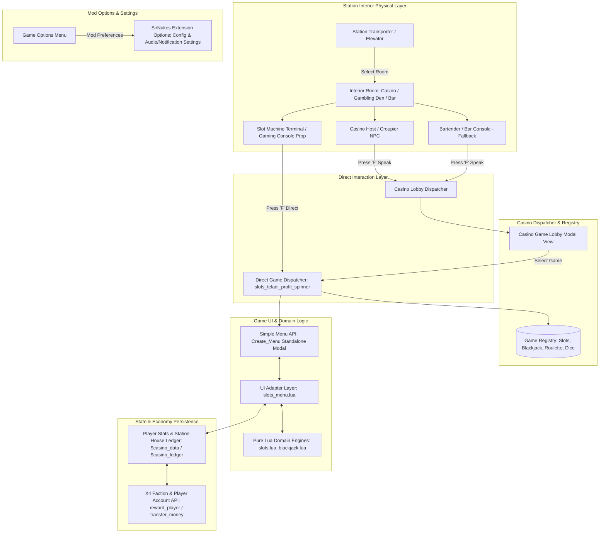
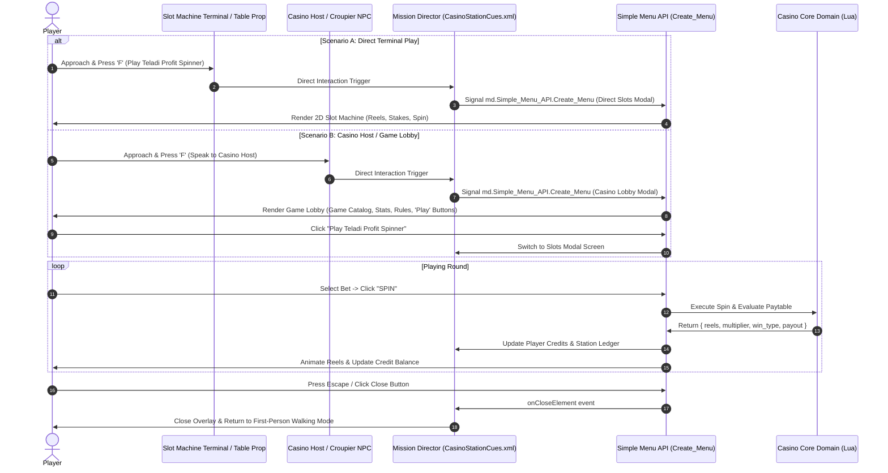

# Architectural Blueprint: Station Interior Physical Interactions & Multi-Game Dispatcher

## 1. Executive Summary

This document specifies the architecture for **physical in-world interactions** within X4: Foundations station interiors (Casino modules, Gambling Den modules, and Station Bars) to launch mini-games (commencing with the **Teladi Profit Spinner 3-Reel Slots** and designed for seamless expansion to **Blackjack, Roulette, and Dice**).

### Objectives
1. **Physical Immersion:** Allow players to walk into a station Casino/Gambling Den/Bar, approach a Croupier NPC, Bartender, or Gaming Console, press **'F'** (Speak/Interact), and engage in casino games in-world.
2. **Multi-Game Extensibility:** Establish a **Game Registry & Dispatcher** pattern enabling both direct game launches (from dedicated tables/dealers) and a centralized **Casino Game Lobby** menu.
3. **Station Economy & House Ledger:** Model local station ownership—NPC station casinos take house profits for the local faction, while player-owned station casinos generate passive dividends and collect losses into station trade accounts.
4. **Clean Mod Configuration Separation:** Transition the game launching entirely into the physical game world. The SirNukes Extension Options menu is repurposed exclusively for **Mod Configuration & Preferences** (e.g. notifications, audio cues, debug toggles).

---

## 2. System Architecture & Component Boundaries



---

## 3. Physical Station Entry Points & Room Detection

### 3.1 Room Hierarchy & Types
In *X4: Foundations*, station modules provide interior rooms accessible via the station transporter (turbolift):

| Station Module | Interior Room Type | Availability | Target Environment | Interactive Triggers |
|---|---|---|---|---|
| **Casino Module** | `roomtype.casino` / `room_casino` | Built on Station (Player or NPC) | Primary high-roller casino floor | Slot Terminals (Direct Play) + Casino Host (Game Lobby) |
| **Gambling Den Module** | `roomtype.gamblingden` / `room_gamblingden` | Built on Station (Player or NPC) | Pirate/underworld casino lounge | Slot Terminals (Direct Play) + Pit Boss (Game Lobby) |
| **Station Bar** | `roomtype.bar` / `room_bar` | Unlocked via Bar missions / Pirate bases | Fallback casual gambling venue | Bartender / Bar Console (Game Lobby) |
| **Habitation / Lounge** | `roomtype.corridor` / `room_lounge` | Standard station docks | General fallback if welfare module missing | Lounge Terminal (Game Lobby) |

### 3.2 Room Detection Logic (MD Scripting)
When the player triggers an interaction or enters an interior, MD inspects the player's spatial context:
- `player.entity.room` or `player.room`: The current room object.
- `player.entity.station` or `player.station`: The host station component.
- `player.station.owner`: Station owner faction (determines if the house cut belongs to the Player or an NPC faction like `faction.teladi`).

---

## 4. Interaction Mechanisms: Direct Terminal Play & Casino Host Lobby



### 4.1 Direct Terminal / Object Interaction (Instant Play)
- Slot machine terminals and console props in casino rooms are equipped with direct interaction cues.
- Approaching a terminal displays `[F] Play Teladi Profit Spinner`.
- Pressing `'F'` immediately opens the 2D slot machine modal overlay with zero dialogue camera zoom and zero conversation wheel lag.

### 4.2 Casino Host / Croupier Interaction (Central Game Lobby)
- Approaching the Casino Host / Croupier displays `[F] Speak to Casino Host`.
- Pressing `'F'` immediately opens the **Casino Game Lobby** modal overlay.
- From the Lobby, players can:
  - Browse all active and upcoming casino games.
  - Launch any specific game with one click.
  - Review lifetime gambling statistics (wagers, winnings, net profit, jackpots).
  - Inspect the Station House Ledger (if on a player-owned station).

---

## 5. Extensible Multi-Game Dispatcher Architecture

To support the immediate 3-Reel Slots game and allow future games (Blackjack, Roulette, Craps) to be plugged in without refactoring the station interaction cues, we establish a **Game Registry** structure.

### 5.1 Game Registry Schema

```lua
-- lua/casino_core/game_registry.lua
local GameRegistry = {
    games = {
        ["slots_teladi_profit_spinner"] = {
            id = "slots_teladi_profit_spinner",
            name = "Teladi Profit Spinner",
            category = "slots",
            tagline = "3-Reel Classic Fruit/Ore Slot Machine",
            min_bet = 1000,
            max_bet = 100000,
            default_bet = 5000,
            status = "active",       -- "active" | "maintenance" | "coming_soon"
            ui_menu_id = "x4_casino_slots_menu",
            open_cue = "md.CasinoStationCues.Open_Slots_Direct"
        },
        ["blackjack_21"] = {
            id = "blackjack_21",
            name = "Space 21 Blackjack",
            category = "cards",
            tagline = "Single-Deck Dealer Blackjack (Pays 3:2)",
            min_bet = 5000,
            max_bet = 500000,
            default_bet = 10000,
            status = "coming_soon",
            ui_menu_id = "x4_casino_blackjack_menu",
            open_cue = "md.CasinoStationCues.Open_Blackjack_Direct"
        },
        ["roulette_orbital"] = {
            id = "roulette_orbital",
            name = "Orbital Roulette",
            category = "roulette",
            tagline = "European Single-Zero High-Roller Wheel",
            min_bet = 2500,
            max_bet = 1000000,
            default_bet = 25000,
            status = "coming_soon",
            ui_menu_id = "x4_casino_roulette_menu",
            open_cue = "md.CasinoStationCues.Open_Roulette_Direct"
        }
    }
}
```

### 5.2 Game Selection Lobby UI (`Simple_Menu_API`)
When interacting with a generic Casino Host / Bartender or selecting "Game Lobby", a clean 2-column or 3-column table is rendered:
- **Left Column:** List of available games with category badges (`[SLOTS]`, `[CARDS]`, `[ROULETTE]`).
- **Center/Right Column:** Game details, paytable preview, min/max stakes, and a prominent **"PLAY NOW"** button.

---

## 6. Economy, Accounting & House Ledger

### 6.1 State Data Model
Casino statistics and financial records are persisted on `player.entity.$casino_data` and station components:

```xml
<!-- Player Global Casino Ledger -->
player.entity.$casino_data:
  $TotalSpins       : Integer (Total spins across all sessions)
  $TotalWagered     : Integer (Credits wagered)
  $TotalWon         : Integer (Credits won from payouts)
  $NetProfit        : Integer (TotalWon - TotalWagered)
  $JackpotsHit      : Integer (Count of 50x Teladi Jackpots)
  $CurrentBet       : Integer (Last selected bet)
  $ActiveStation    : Component (Station where currently gambling)

<!-- Station House Ledger (for Player-owned & NPC stations) -->
station.$casino_ledger:
  $HouseGrossRevenue : Integer (Credits collected from player/NPC losses)
  $HousePayoutsTotal : Integer (Credits paid out to winners)
  $HouseNetIncome    : Integer (GrossRevenue - PayoutsTotal)
  $VisitCount        : Integer (Number of gambling sessions)
```

### 6.2 The House Mechanic & Account Routing
1. **NPC Faction Stations:**
   - Wagers: Deducted from player wallet (`player.money`) and credited to host faction economy.
   - Payouts: Paid directly from the host faction/station reserve to player wallet (`player.money`).

2. **Player-Owned Stations (Closed-Loop House Accounting):**
   - **Wagers:** Transferred from player personal wallet (`player.money`) into the station trade account (`station.money`).
   - **Payouts:** Paid out directly from the station trade account (`station.money`) into player personal wallet (`player.money`).
   - **Passive Income:** Station generates simulated periodic casino revenue from NPC visitors/crew utilizing the welfare module.

### 6.3 Underfunded Player Station Protection & Solvency
To prevent script errors, negative balances, or unpaid jackpots at player-owned stations:
1. **Pre-Spin Solvency Check:**
   - Prior to a spin, the UI verifies if `station.money >= ($CurrentBet * $MaxMultiplier)` (e.g. 5,000 Cr bet $\times$ 50x jackpot = 250,000 Cr reserve requirement).
   - If the station treasury cannot cover the theoretical jackpot, bet buttons that exceed solvency are visually disabled, and a status banner prompts:  
     `"Station Treasury Low: Requires [X] Cr to back max jackpot. Deposit funds at station manager or lower bet."`
2. **Graceful Drain Fallback:**
   - In any edge-case payout where `station.money < $payoutInternal`, the station pays out its entire remaining balance down to 0 Cr and notifies the player:  
     `"JACKPOT! Station treasury drained: Received [X] Cr (Station account balance is now 0 Cr)."`

### 6.4 Owner Free-Play / Demo Mode Toggle
- On player-owned stations, the game interface provides a zero-risk **"Owner Free Play (Demo Mode)"** toggle.
- When enabled:
  - `$CurrentBet` is treated as 0 Cr.
  - Reel mechanics, odds, and RNG state machines run normally for pure gameplay enjoyment and testing.
  - Wallet balance and station treasury are left untouched.

---

## 7. Trade-off Analysis & Architectural Decisions

| Decision Area | Options Evaluated | Selected Architectural Choice | Rationale & Trade-offs |
|---|---|---|---|
| **Physical Interaction Entry Point** | A: Custom 3D meshes with hardcoded collision triggers.<br>B: Vanilla NPC Conversation Wheel (`g_conversation`).<br>C: Direct Terminal & Casino Host 'F' Triggers. | **Option C: Direct Terminal & Casino Host 'F' Triggers** | Bypasses the clunky vanilla dialogue camera and conversation wheel entirely. Prevents mod conflicts with dialogue-overhaul mods while providing instant, responsive mini-game launching. |
| **UI Menu Rendering** | A: Full-screen X4 custom XPL/Lua canvas.<br>B: SirNukes `Simple_Menu_API.Create_Menu` standalone modal.<br>C: In-dialogue text choices. | **Option B: SirNukes `Create_Menu` standalone modal** | Provides high-fidelity 2D box/button widgets, custom reel displays, responsive buttons, and clean open/close hooks without replacing vanilla core UI files. |
| **UI Framework Ecosystem** | A: Standalone SirNukes API only.<br>B: Combined SirNukes + kuertee UI Extensions. | **Option B: Combined Framework Support** | SirNukes provides the 2D modal rendering API; `kuertee_ui_extensions` provides non-destructive UI lifecycle hooks, clean screen manager cleanup, and HUD interaction event integration without file collisions. |
| **Multi-Game Architecture** | A: Monolithic single-script slots file.<br>B: Modular Registry & Dispatcher pattern. | **Option B: Modular Registry & Dispatcher** | Decouples game logic engines (`slots.lua`, `blackjack.lua`) from the interaction layer. Allows adding new games by registering a table entry. |
| **Player Balance Handling** | A: Custom mod casino chips/tokens.<br>B: Direct X4 Credits (`player.money`). | **Option B: Direct X4 Credits (with internal 1 Cr = 100 internal units)** | Standard X4 gameplay loop: gambling directly impacts the player's wallet and station ledger. Zero friction exchanging tokens. |

---

## 8. Technical Work Backlog for `xp-developer`

The following modular tasks are queued for implementation in Phase 2:

### Phase 2 Task Breakdown

1. **`T8.1` - Game Registry & Dispatcher Scaffolding (`lua/casino_core/game_registry.lua`, `tests/lua/test_game_registry.lua`)**
   - Implement pure Lua game registry module with game registration, filtering by status/category, and metadata queries.
   - Write 100% unit tests in `luaunit`.

2. **`T8.2` - MD Physical Room Detection & Direct Terminal Triggers (`md/CasinoStationCues.xml`)**
   - Add cues detecting player presence in Casino, Gambling Den, and Bar rooms.
   - Bind direct `'F'` interaction on slot terminals/consoles to directly dispatch `slots_teladi_profit_spinner` without conversation camera/wheel.

3. **`T8.3` - Casino Host & Bar Lobby Direct Triggers (`md/CasinoStationCues.xml`)**
   - Bind direct `'F'` interaction on Casino Host / Croupier NPCs and Bar consoles to open the **Casino Game Lobby** modal.

4. **`T8.4` - Standalone Modal Menu Launcher & Game Lobby UI (`Simple_Menu_API.Create_Menu`)**
   - Implement the Casino Game Lobby 2D menu (game catalog, rules, stats overview, Play buttons).
   - Connect Direct Play and Lobby Play to launch the 2D slot machine modal with clean `onCloseElement` exit back to walking mode.

5. **`T8.5` - Station Economy Ledger, Solvency Checks & Owner Free-Play**
   - Implement closed-loop wallet-to-station transfers for player-owned stations.
   - Implement pre-spin solvency validation, graceful drain fallback, and Owner Free-Play (Demo Mode) toggle.
   - Track total spins, wagers, winnings, and station house income on blackboard tables.

6. **`T8.6` - End-to-End Validation, Schema Conformance & Packaging**
   - Execute full test pipeline (`validate_xml.py`, `luacheck`, `luaunit`).
   - Validate XML against `md.xsd`.
   - Update `CHANGELOG.md` and rebuild package `dist/x4_casino_mod.zip`.

---

## 9. Verification & Testability Plan

- **Headless Unit Tests (`scripts/test.ps1`):**
  - Verify game registry query methods.
  - Verify slots menu adapter state machine under mock player money conditions.
- **XML Schema Conformance:**
  - Verify `CasinoStationCues.xml` passes schema validation against `schemas/md.xsd`.
- **In-Game Verification:**
  1. Dock at station with Casino, Gambling Den, or Bar.
  2. Transporter -> Enter room.
  3. Approach Slot Terminal -> Press 'F' -> Verify slot machine opens immediately with current credits.
  4. Approach Casino Host -> Press 'F' -> Verify Casino Game Lobby opens with game catalog and stats.
  5. Place bets, spin reels, verify credit reward/deduction, press Esc/Close -> Verify clean exit back to first-person room.
