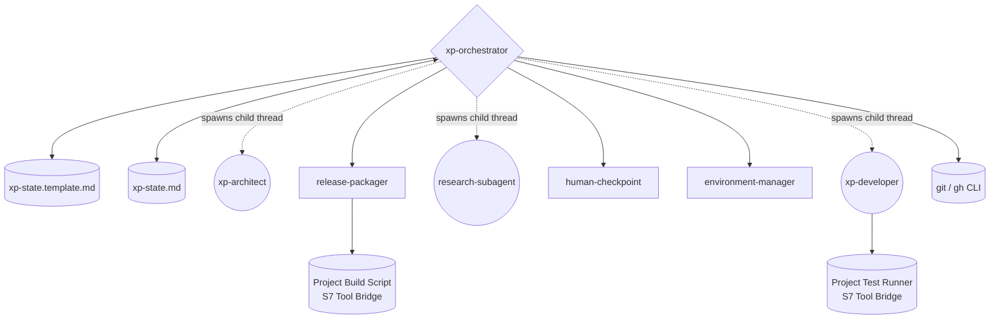
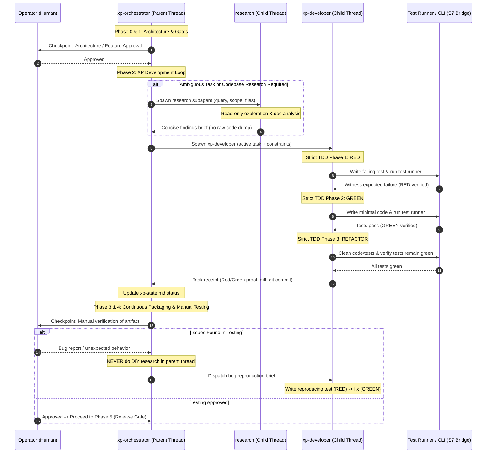
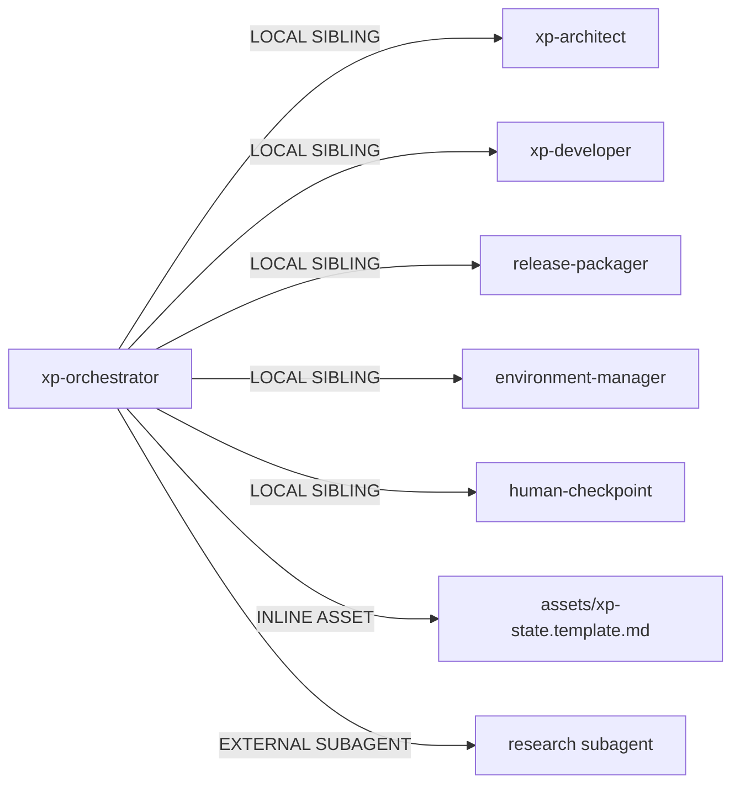

# Genesis Refactor Plan: XP Orchestrator & Developer TDD Rigor

## 1. Intent & Scope

### Problem Statement
In recent feature development, two critical architectural anti-patterns emerged:
1. **Orchestrator Drift / DIY Research**: The `xp-orchestrator` performed open-ended codebase investigations, grepped source files, and diagnosed bugs directly in the orchestrator thread, contaminating its context window and degrading its capacity to govern Git state, human gates, and phase transitions.
2. **Test-After-Code / Vacuous Tests**: The `xp-developer` persona stated "Write the code and tests required to fulfill the active task" and "practice TDD where applicable". This primed the model to write code first and tests second (or skip tests entirely), bypassing the critical RED phase (observing failure before implementation).

### Goals & Boundaries
- **Strict Role Bounding**: Restrict `xp-orchestrator` to a pure coordinator and conductor. Forbid it from reading application source code, running source grep, or diagnosing bugs in the parent thread.
- **Subagent Research Delegation**: Explicitly define pathways to dispatch `research` subagents for codebase exploration, documentation analysis, and log triage, returning concise finding receipts to the orchestrator.
- **Strict Red-Green-Refactor TDD**: Restructure `xp-developer` to mandate the Red -> Green -> Refactor cycle, requiring the developer to execute the project's configured test runner (from `xp-state.md`) to witness test failure before writing implementation code.
- **100% Project Agnostic**: Ensure zero domain coupling (no references to specific games, languages, frameworks, or engines). Configuration is read dynamically from `.agents/plans/xp-state.md`.

---

## 2. Component Diagram (Mermaid)

---

## 3. Thread / Sequence Diagram (Mermaid)

---

## 4. Dependency Graph & Composition Decisions (Step 3.5)

### Module Composition Table
| Module | Composition Mode | Rationale |
|---|---|---|
| `xp-orchestrator` | LOCAL SIBLING | Primary workflow manager in `.agents/skills/`, synced to `DrewGamer/agent-xp-workflow`. |
| `xp-developer` | LOCAL SIBLING | Core XP persona in `.agents/personas/`, synced to `DrewGamer/agent-xp-workflow`. |
| `xp-architect` | LOCAL SIBLING | Systems design persona in `.agents/personas/`. |
| `research` | EXTERNAL SUBAGENT | Standard environment read-only subagent for research/exploration without parent context pollution. |
| `assets/xp-state.template.md` | INLINE ASSET | Template asset owned by `xp-orchestrator`. |

---

## 5. Separation of Concerns & Compliance (Step 4 & 5)

### Anti-Patterns Prevented
1. **DIY Research / Orchestrator Drift**: Orchestrator reading project source code, running source grep, or diagnosing bugs directly in the parent thread.
2. **Context Window Exhaustion**: Filling the orchestrator thread with noisy source files and logs, degrading git state tracking.
3. **Vacuous Tests / Test-After-Code**: Implementing code before writing failing tests, or asserting passing status without witnessing the initial failure.
4. **Project Specificity Leakage**: Introducing language-, engine-, or domain-specific hardcodings into transferable skills and personas.

### Compliance Checklist
- [x] Canonical name: `xp-orchestrator` (matches directory).
- [x] Body size: SKILL.md <= 500 lines.
- [x] Description: <= 1024 chars, imperative phrasing, intent-first.
- [x] Pure project-agnostic design (test runner and build commands sourced from `xp-state.md`).
- [x] ASCII only.

---

## 6. Token Economics & Cost Projection (Step 3.2)

- **Stance**: `balanced`
- **Prefix Design**: Pure coordinator has a lean context footprint; does not ingest project source code.
- **Child Isolation**:
  - `research` subagent handles multi-file lookups in an isolated child thread, returning a 200–500 token synthesis.
  - `xp-developer` executes in an isolated child thread per task, preventing task accumulation.
- **Observed Delta**: Saves ~15k–30k tokens of raw file inspection per debugging cycle in the parent thread.

---

## 7. Action Plan (Todos)

1. [x] Update [.agents/personas/xp-developer.md](file:///C:/Projects/X4_CasinoMod/.agents/personas/xp-developer.md):
   - Replace "Write the code and tests" with explicit Red-Green-Refactor sequence.
   - Mandate executing the project's configured test runner to verify RED before writing implementation.
   - Define handling for declarative/non-unit-testable assets (static analysis / schema validation).
   - Add anti-patterns: `Vacuous Tests / Test-After-Code`, `Skipping the Red Phase`.
2. [x] Update [.agents/skills/xp-orchestrator/SKILL.md](file:///C:/Projects/X4_CasinoMod/.agents/skills/xp-orchestrator/SKILL.md):
   - Add Pure Coordinator Mandate in Overview & Lens.
   - Forbid reading application source files, grepping codebase, or diagnosing bugs in parent thread.
   - Add Research Delegation step: dispatch `research` subagent for codebase queries or documentation surveys.
   - Update Phase 2 to verify TDD receipt (Red -> Green execution proof) from developer.
   - Update Phase 4 (Manual Testing Loop): forward human bug reports directly to `xp-developer` (with reproducing test requirement) or `research` without parent thread DIY diagnosis.
   - Add Anti-Patterns: `DIY Research / Orchestrator Drift`, `Context Exhaustion`.
3. [x] Validate both files against line budgets, project independence, and markdown syntax.
